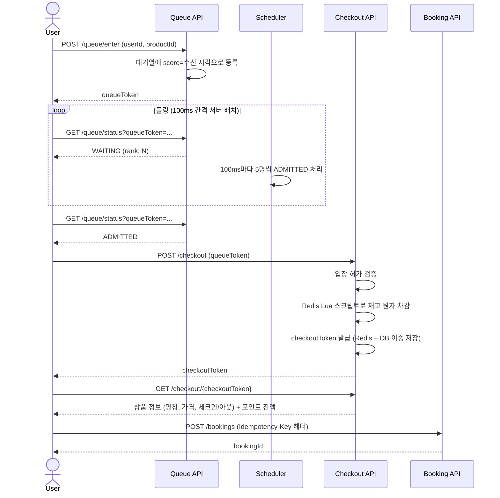
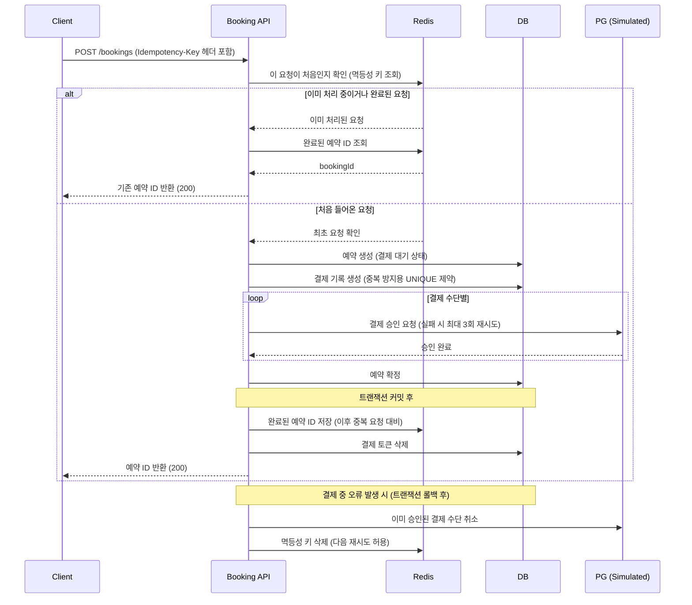
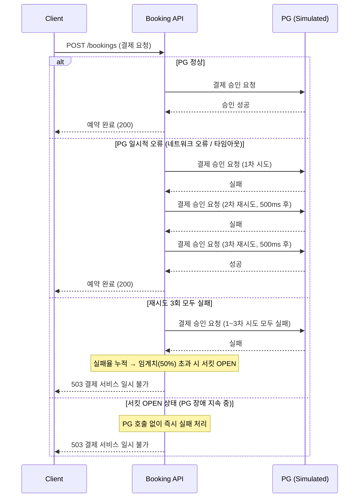
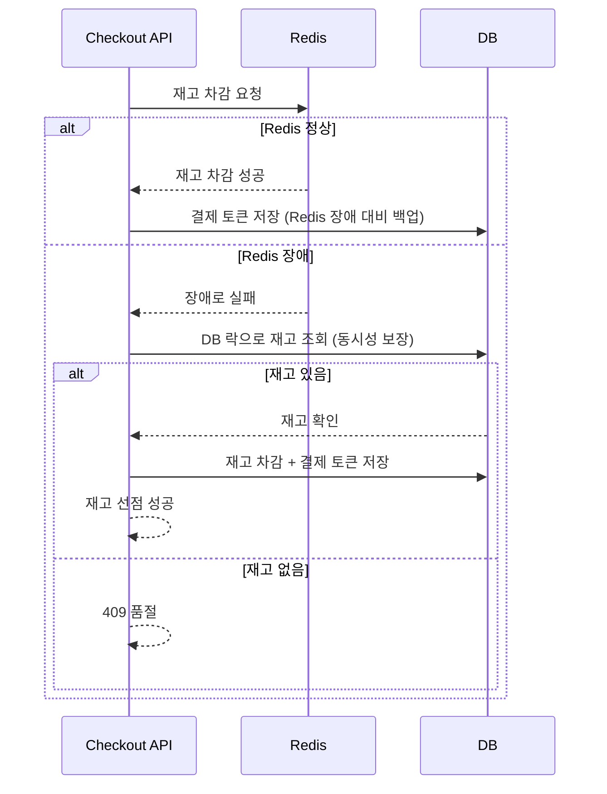
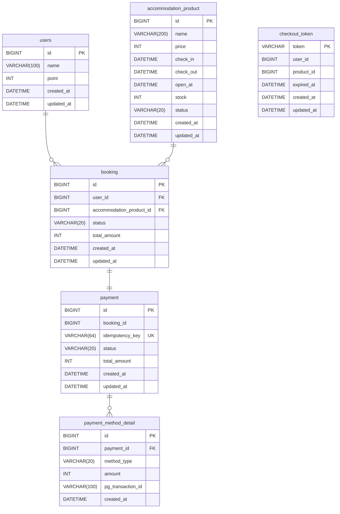

# Flash Accommodation Booking

재고 정합성, 공정성, 멱등성, 결제 확장성, 장애 대응 등 주요 기술적 쟁점과 선택의 근거는 [DECISIONS.md](./DECISIONS.md)에 정리했습니다.

브랜치별 구체적인 작업 내용은 PR 메시지로 정리해두었습니다. 

## 기술 스택

| 분류 | 기술 |
|------|------|
| Language | Java 21 |
| Framework | Spring Boot 3.5 |
| Database | MySQL 8.0 |
| Cache | Redis 7 |
| Infra | Docker, Nginx (애플리케이션 서버 2대) |
| 분산 락 | Redisson |
| 장애 대응 | Resilience4j (CircuitBreaker, Retry) |

---

## 시스템 아키텍처

```
         ┌─────────────────────────────────────────┐
         │              Client                     │
         └────────────────────┬────────────────────┘
                              │ :80
         ┌────────────────────▼────────────────────┐
         │          Nginx (Load Balancer)           │
         │             Round-Robin                 │
         └──────────┬──────────────────┬───────────┘
                    │                  │
         ┌──────────▼──────┐  ┌────────▼────────┐
         │   App Server 1  │  │  App Server 2   │
         │  Spring Boot    │  │  Spring Boot    │
         │   :8080         │  │   :8080         │
         └──────────┬──────┘  └────────┬────────┘
                    │                  │
         ┌──────────▼──────────────────▼──────────┐
         │                                        │
         │   MySQL :3306        Redis :6379        │
         │                                        │
         └────────────────────────────────────────┘
```

---

## 실행 방법

### 1. 환경변수 파일 생성

`.env.example`을 참고해 프로젝트 루트에 `.env` 파일을 생성합니다. 

```bash
cp .env.example .env
```

### 2. 애플리케이션 빌드

```bash
./gradlew build -x test
```

### 3. Docker Compose 실행

```bash
docker-compose up --build
```


### 4. API 확인

- Swagger UI: `http://localhost/swagger-ui/index.html`

---

## API 목록

### 대기열

| Method | Path | 설명 |
|--------|------|------|
| `POST` | `/queue/enter` | 대기열 등록 및 대기열 토큰 발급 |
| `GET` | `/queue/status?queueToken={token}` | 현재 대기 순번 및 상태 조회 |

### 재고 선점 / 주문서

| Method | Path | 설명 |
|--------|------|------|
| `POST` | `/checkout` | 재고 선점 및 결제용 checkoutToken 발급 (TTL 5분) |
| `GET` | `/checkout/{checkoutToken}` | 주문서 조회 (상품 정보 + 포인트 잔액) |

### 예약

| Method | Path | 설명 |
|--------|------|------|
| `POST` | `/bookings` | 결제 진행 및 예약 확정 |

`POST /bookings` 요청 헤더에 `Idempotency-Key`를 포함해야 합니다.

---

## 시퀀스 다이어그램

### 전체 흐름



### 예약 API 상세 (멱등성 + 결제 보상)



### PG사 장애 시 대응 흐름



### Redis 장애 시 재고 선점 폴백



---

## ERD



---

## DDL

```sql
CREATE TABLE users (
    id          BIGINT       NOT NULL AUTO_INCREMENT,
    name        VARCHAR(100) NOT NULL,
    point       INT          NOT NULL,
    created_at  DATETIME(6),
    updated_at  DATETIME(6),
    PRIMARY KEY (id)
);

CREATE TABLE accommodation_product (
    id          BIGINT       NOT NULL AUTO_INCREMENT,
    name        VARCHAR(200) NOT NULL,
    price       INT          NOT NULL,
    check_in    DATETIME(6)  NOT NULL,
    check_out   DATETIME(6)  NOT NULL,
    open_at     DATETIME(6)  NOT NULL,
    stock       INT          NOT NULL,
    status      VARCHAR(20)  NOT NULL,
    created_at  DATETIME(6),
    updated_at  DATETIME(6),
    PRIMARY KEY (id)
);

CREATE TABLE booking (
    id                       BIGINT      NOT NULL AUTO_INCREMENT,
    user_id                  BIGINT      NOT NULL,
    accommodation_product_id BIGINT      NOT NULL,
    status                   VARCHAR(20) NOT NULL,
    total_amount             INT         NOT NULL,
    created_at               DATETIME(6),
    updated_at               DATETIME(6),
    PRIMARY KEY (id),
    CONSTRAINT fk_booking_user    FOREIGN KEY (user_id)                  REFERENCES users (id),
    CONSTRAINT fk_booking_product FOREIGN KEY (accommodation_product_id) REFERENCES accommodation_product (id)
);

CREATE TABLE payment (
    id               BIGINT      NOT NULL AUTO_INCREMENT,
    booking_id       BIGINT      NOT NULL,
    idempotency_key  VARCHAR(64) NOT NULL,
    status           VARCHAR(20) NOT NULL,
    total_amount     INT         NOT NULL,
    created_at       DATETIME(6),
    updated_at       DATETIME(6),
    PRIMARY KEY (id),
    UNIQUE KEY uk_payment_idempotency_key (idempotency_key)
);

CREATE TABLE payment_method_detail (
    id                BIGINT      NOT NULL AUTO_INCREMENT,
    payment_id        BIGINT      NOT NULL,
    method_type       VARCHAR(20) NOT NULL,
    amount            INT         NOT NULL,
    pg_transaction_id VARCHAR(100),
    created_at        DATETIME(6),
    PRIMARY KEY (id),
    CONSTRAINT fk_payment_method_detail_payment FOREIGN KEY (payment_id) REFERENCES payment (id)
);

CREATE TABLE checkout_token (
    token       VARCHAR(255) NOT NULL,
    user_id     BIGINT       NOT NULL,
    product_id  BIGINT       NOT NULL,
    expired_at  DATETIME(6)  NOT NULL,
    created_at  DATETIME(6),
    updated_at  DATETIME(6),
    PRIMARY KEY (token)
);
```

---

## Redis 키 구조

| 키 | 타입 | 설명 | TTL |
|----|------|------|-----|
| `open:{productId}` | Hash | 상품 오픈 시각 (`openAt` 필드) | 없음 |
| `queue:waiting:{productId}` | Sorted Set | 대기열 (score = 요청 수신 timestamp) | 없음 |
| `queue:admitted:{productId}` | Set | 입장 허가된 토큰 목록 | 없음 |
| `queue:token:{queueToken}` | Hash | 대기열 토큰 정보 (userId, productId, status) | 30분 |
| `stock:{productId}` | String | Redis 재고 수량 | 없음 |
| `checkout:{checkoutToken}` | String | `userId:productId` | 5분 |
| `idempotency:{idempotencyKey}` | String | `"processing"` 또는 `bookingId` | 24시간 |
